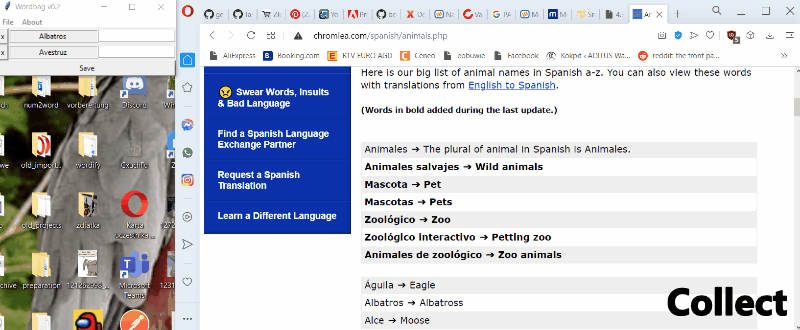
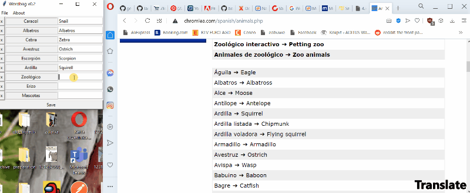
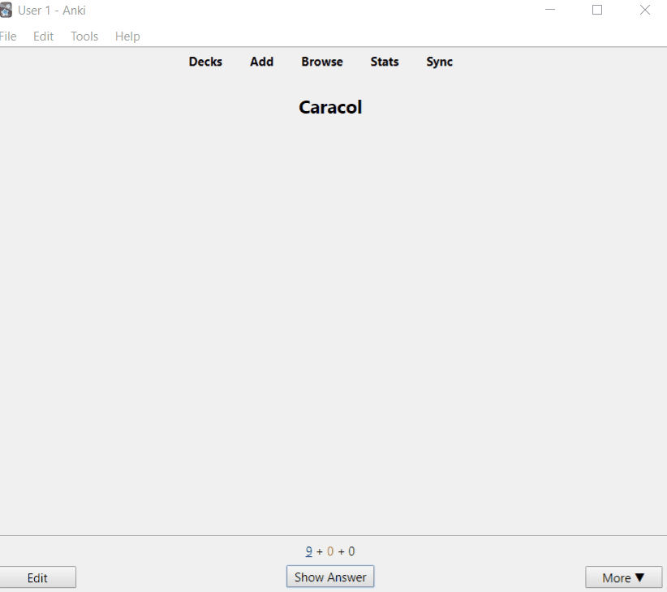

# Wordbag
Wordbag is a Desktop Daemon tool for sentence mining.

## Collect
Wordbag automatically collects the contents you have copied to clipboard saving you the few unnecessary clicks

## Translate
Provide your own translations for the insterted items, click `Save` and...

## Learn and Revise
Using automatically updated Anki decks.

The wordbag explorer allows you to annotate, translate and organise and revise the collected snippets in any way you would like to.

The software only currently works on Windows.

